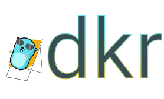

# 

 
 
 
 
 
Light CLI application to make it easier for developers to interact with docker containers.

Provides an interactive interface over couple of docker commands so it can be easily utilised while working with docker containers a lot and you prefer something simple and light.

## Table of contents
* [How does it work](#how-does-it-work)
* [Install](#install)
    * [Linux](#linux)
    * [OSx](#osx)
* [Credits](#credits)

## How does it work

## Credits

Big thanks to [MariaLetta](https://github.com/MariaLetta/free-gophers-pack) for the Gopher in the headline!
