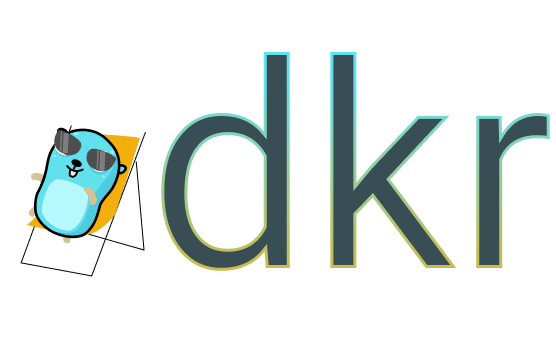

# 

[](https://goreportcard.com/report/github.com/Roverr/dkr)
 [](https://codeclimate.com/github/Roverr/rtsp-stream/maintainability)
 [](https://opensource.org/licenses/MIT)
 
 
 
Light CLI application to make it easier for developers to interact with docker containers.

It can be utilisied while working regularly with containers as a developer. Provides a nice CLI user interface to do basics.

<p align="center">
    
</p>

## Table of contents
* [How to use](#how-does-it-work)
* [Install](#install)
    * [Linux](#linux)
    * [OSx](#osx)
* [Improvements](#improvements)
* [Credits](#credits)

## How to use

dkr is a really simple CLI application to help you with your everyday tasks around docker containers.<br/>
It is written in Go to ensure proper distribution for the main developer platforms.

dkr implements 3 commands right now:
* **exec** - For times when you have to enter the container and manually check things
* **logs** - When you want to see the logs of the container
* **stop** - To stop the container

The reason for having this 3 is that in my experience most of the time when I use `docker ps` I want to do one of these commands. As a common user I think an interactive version is better.

You can use it in 2 ways:
* You can simply type `dkr` - This will lead you to the containers where you will be selecting what to do
* You can also type the commands mentioned above like `dkr logs` - This way you will only be asked to choose a container

<p align="center">
    
</p>

## Install

**Docker has to be installed beforehand** 


* Manual installation
    * clone the repository under `github.com/Roverr/dkr`
    * `dep ensure` (install dep before)
    * `go build .` (install go before)
    * Move the binary into your path
* Choose a binary packed under [the latest release](https://github.com/Roverr/dkr/releases)
* Use the following scripts below

### Linux

### OSx

```s
brew tap roverr/opensource
brew install dkr
```

## Improvements

Have a use case similiar to what this application is made for?<br/>
[Open an issue](https://github.com/Roverr/dkr/issues/new) describing it!

## Credits

Big thanks to [MariaLetta](https://github.com/MariaLetta/free-gophers-pack) for the Gopher in the headline!
